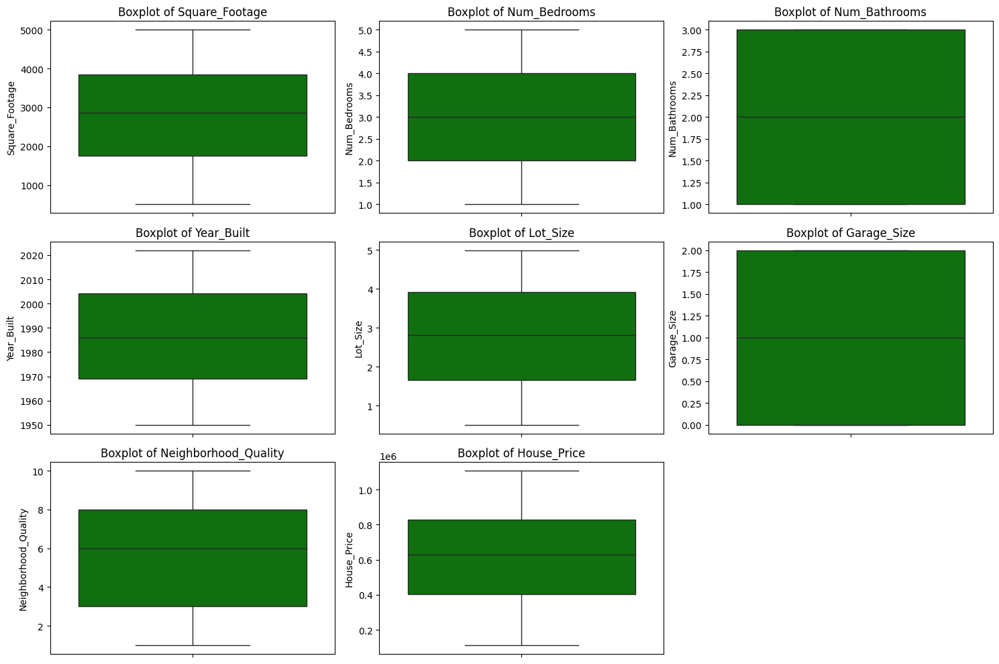
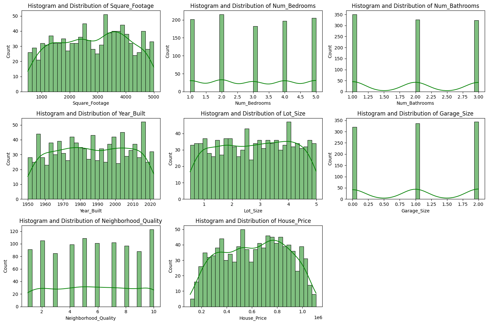
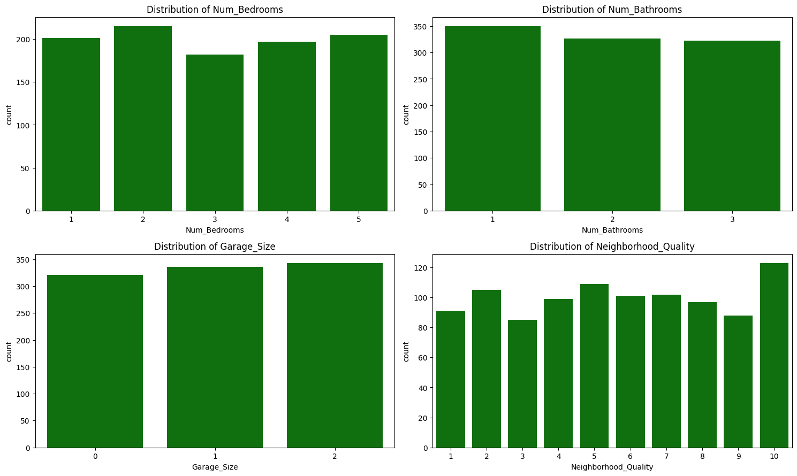

# House Price Prediction Using Machine Learning

## Background 
Determining a competitive house price is a challenge for sellers and real estate agents because house prices are influenced by various factors such as size, location, facilities, and market conditions.
Manual processes often fall short in addressing this complexity. As a data scientist at a proptech startup, we adopt a machine learning-based approach to develop a house price prediction platform. This platform is designed to provide accurate price estimates for new data, including in markets that have not been previously analyzed.
Through this platform, we aim to assist stakeholders, such as sellers and real estate agents, in determining competitive house prices more efficiently and data-driven.

## Goal 
Develop a machine learning platform capable of predicting house prices with high accuracy.

## Objective
1. Analyze factors influencing house prices, such as size, facilities, and various other aspects, using Exploratory Data Analysis (EDA).
2. Build and train machine learning regression model to generate accurate house price predictions based on historical data.
3. Determine which features have an impact on the increase in house prices.

## Tool
1. Python Programming Language
2. JupyerLab / Jupyter Notebook

## Evaluation Metric
1. Mean Absolute Percentage Error (MAPE).
2. R-Square.

## Dataset
| **Feature**            | **Description**                                                                                       |
|-------------------------|-------------------------------------------------------------------------------------------------------|
| **Square_Footage**      | The size of the house in square feet. Larger homes typically have higher prices.                      |
| **Num_Bedrooms**        | The number of bedrooms in the house. More bedrooms generally increase the value of a home.            |
| **Num_Bathrooms**       | The number of bathrooms in the house. Houses with more bathrooms are typically priced higher.         |
| **Year_Built**          | The year the house was built. Older houses may be priced lower due to wear and tear.                  |
| **Lot_Size**            | The size of the lot the house is built on, measured in acres. Larger lots tend to add value to a property. |
| **Garage_Size**         | The number of cars that can fit in the garage. Houses with larger garages are usually more expensive. |
| **Neighborhood_Quality**| A rating of the neighborhood’s quality on a scale of 1-10, where 10 indicates a high-quality neighborhood. Better neighborhoods usually command higher prices. |
| **House_Price**         | The price of the house, which is the dependent variable you aim to predict.                           |

## 1. Exploratory Data Analysis
### 1.1 Summary Statistics
| Feature               | Count   | Mean         | Std Dev      | Min       | 25%       | 50%       | 75%       | Max         |
|-----------------------|---------|--------------|--------------|-----------|-----------|-----------|-----------|-------------|
| **Square_Footage**    | 1000.0  | 2815.422000  | 1255.514921  | 503.000   | 1749.500  | 2862.500  | 3849.500  | 4999.000    |
| **Num_Bedrooms**      | 1000.0  | 2.990000     | 1.427564     | 1.000     | 2.000     | 3.000     | 4.000     | 5.000       |
| **Num_Bathrooms**     | 1000.0  | 1.973000     | 0.820332     | 1.000     | 1.000     | 2.000     | 3.000     | 3.000       |
| **Year_Built**        | 1000.0  | 1986.550000  | 20.632916    | 1950.000  | 1969.000  | 1986.000  | 2004.250  | 2022.000    |
| **Lot_Size**          | 1000.0  | 2.778087     | 1.297903     | 0.506058  | 1.665946  | 2.809740  | 3.923317  | 4.989303    |
| **Garage_Size**       | 1000.0  | 1.022000     | 0.814973     | 0.000     | 0.000     | 1.000     | 2.000     | 2.000       |
| **Neighborhood_Quality** | 1000.0  | 5.615000     | 2.887059     | 1.000     | 3.000     | 6.000     | 8.000     | 10.000      |
| **House_Price**       | 1000.0  | 618861.018647| 253568.058375| 111626.853| 401648.229| 628267.291| 827141.278| 1108237.000 |

### 1.2 Univariate Analysis
#### 1.2.1 Boxplot

It appears that none of the features have outliers.

#### 1.2.2 Histogram and Distribution Line

The distribution of eacfeaturesnt is nearly close to a normal distribution.

#### 1.2.3 Distibution of Number of Bedroom, Number of Bathroom, Garage Size, and Neighborhood Quality.

1. The number of houses is dominated by those with a neighborhood quality rating of 10.
2. The number of houses is mostly dominated by those with 2 garages, although the difference compared to those with 0 or 1 garage is not very significant.
3. The number of houses is mostly dominated by those with 2 bedrooms, but the difference is also not very significant compared to houses with 1, 3, 4, or 5 bedrooms.
4. The number of houses is mostly dominated by those with 1 bathroom, and the difference is also not very significant compared to houses wi or 3th 2 bathrooms.

### 1.3 Bivariate Analysis
#### 1.3.1 Number of Bedrooms, Number of Bathroom, Garage Size, and Neighborhood Quality vs House Price

#### 1.3.2 House Price Trend by Year Built

### 1.4 Multivariate Analysis
#### 1.4.1. Heatmap Correlation
#### 1.4.2 Pairplot

## 2. Modeling
### 2.1 Fit Model
### 2.2 Evaluation Metrics
### 2.3 Feature Impact
### 2.4 Business Recommendation

